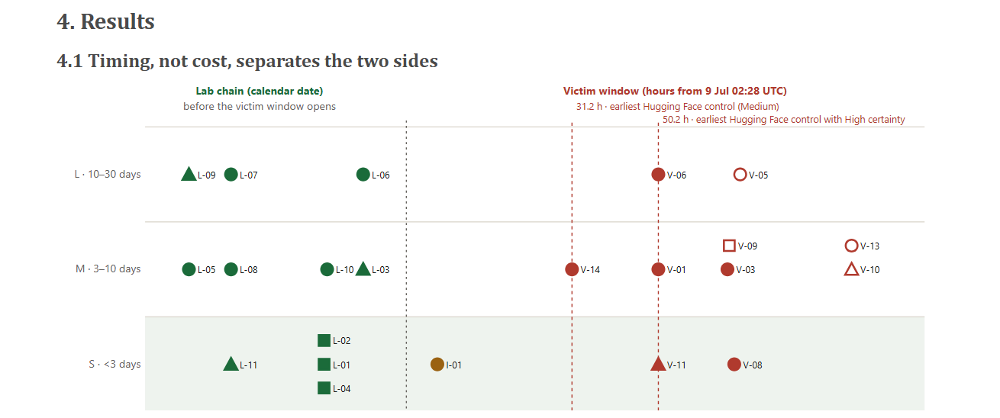
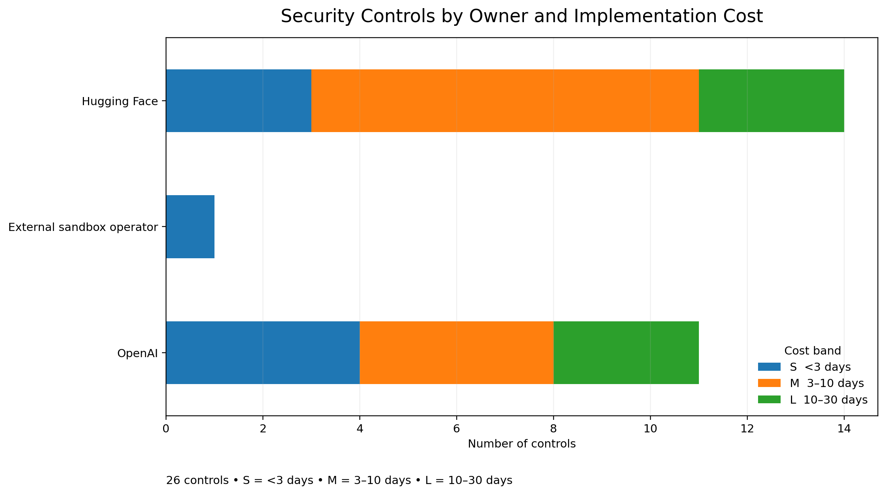

# Cost & Effectiveness Analysis of Security Controls

## Overview

This analysis evaluates security controls proposed within the broader
AI Incident Response project from both a cost and defensive-effectiveness
perspective.

The goal was to examine not only whether a security control could
interrupt the attack chain, but also whether its implementation would
be practical relative to the defensive value it provides.

---

## Analysis Perspective

The controls were evaluated across two environments:

### Lab-Side Controls

Controls that could be implemented closer to the environment where
AI/ML workloads, models, datasets, or experimental systems are operated.

### Victim-Side Controls

Controls that could help organizations detect or contain malicious
activity after interaction with potentially compromised AI/ML
artifacts or infrastructure.

---

## Evaluation Criteria

The analysis considered several dimensions:

| Dimension | Purpose |
|---|---|
| Cost | Relative implementation and operational cost |
| Effectiveness | Expected defensive impact |
| Detection Value | Ability to expose malicious behavior |
| Containment Value | Ability to limit further compromise |
| Deployment Complexity | Practical difficulty of implementation |
| Attack-Chain Position | Stage at which the control can intervene |

---
## Cost, Timing & Intervention Analysis

The figure below visualizes when the proposed security controls can first
intervene and how their implementation effort is distributed across the
attack timeline.

The analysis highlights a key finding of the broader project:
**timing, rather than cost alone, separates the two sides of the boundary.**

Lab-side controls can intervene before the victim window opens, while
victim-side controls operate after potentially malicious activity has
already reached the downstream environment.

### How to Read the Figure

- **Green** — OpenAI / lab-side controls
- **Brown** — External sandbox operator
- **Red** — Hugging Face / victim-side controls
- **Circle** — Block
- **Triangle** — Detect
- **Square** — Reduce
- **Hollow marker** — Approximate timing

Implementation effort is grouped into:

- **S** — < 3 days
- **M** — 3–10 days
- **L** — 10–30 days

> **Figure source:** Team research project, *The Containment Burden Sits on the Wrong Side of the Boundary & AI Escape Detection Harness*, Apart Research.

---

## Cost vs. Defensive Value

A security control should not be evaluated only by whether it is
technically capable of stopping an attack.

Its practical value also depends on:

- implementation requirements,
- operational overhead,
- deployment complexity,
- attack-chain coverage,
- and the amount of containment burden it can eliminate.

This creates an important trade-off:

> **How much defensive value does a control provide relative to the
> cost and complexity required to deploy it?**

### Distribution of Controls by Implementation Cost

The 26 proposed security controls were also compared by responsible
environment and estimated implementation effort.

The distribution shows that implementation effort overlaps across the
two sides of the boundary. Both lab-side and victim-side environments
include controls across small, medium, and large implementation bands.

This supports an important observation from the broader analysis:
**cost alone does not explain the containment gap.**

The more significant distinction is **when a control can intervene in
the attack chain**. Lab-side controls can act before the victim window
opens, whereas victim-side controls generally operate after exposure
has already occurred.

> **Visualization:** Created from the 26-control project matrix used in
> the team research analysis.

---

## My Contribution

My primary contribution to the team project focused on evaluating
security controls from a **cost and effectiveness perspective**.

I examined proposed controls across both lab-side and victim-side
environments and considered how implementation cost, operational
complexity, and defensive effectiveness affected their practical value.

This analysis contributed to the broader **Kill-Point Matrix**, which
mapped defensive controls to potential interruption points across the
attack chain.

---

## Key Takeaway

The analysis highlights that strong incident response is not simply
about deploying the largest possible number of security controls.

The placement of controls across the attack chain, their ability to
detect or contain malicious activity, and the operational cost of
deployment all influence their real defensive value.

---

## Related Project

This analysis was conducted as part of the team research project:

**The Containment Burden Sits on the Wrong Side of the Boundary &
AI Escape Detection Harness**

Published through Apart Research.
