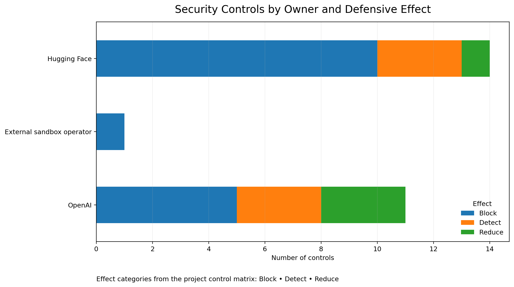

# Security Control Analysis

## Overview

The broader incident-response analysis evaluated **26 security controls**
across the AI/ML attack chain.

Rather than treating all controls as equivalent, the analysis considered
where each control operates, who is responsible for implementing it, and
what defensive effect it provides.

The controls span three environments:

- **OpenAI / Lab-side**
- **External sandbox operator**
- **Hugging Face / Victim-side**

---

## Defensive Effects

The controls were grouped according to their primary defensive effect.

### Block

Blocking controls are intended to prevent or interrupt malicious activity
before it can progress further through the attack chain.

Examples include controls that restrict execution, isolate workloads, or
prevent dangerous actions from reaching downstream systems.

### Detect

Detection controls focus on identifying suspicious or malicious behavior.

These controls improve visibility and can provide the signals required for
incident-response teams to investigate and escalate suspicious activity.

### Reduce

Reduction controls may not completely stop an attack, but can reduce its
impact, limit attacker capabilities, or decrease the resulting containment
burden.

---

## Control Distribution

The following visualization summarizes the defensive effect of the
26 controls across the three responsible environments.

### Distribution

| Environment | Block | Detect | Reduce | Total |
|---|---:|---:|---:|---:|
| OpenAI / Lab-side | 5 | 3 | 3 | 11 |
| External sandbox operator | 1 | 0 | 0 | 1 |
| Hugging Face / Victim-side | 10 | 3 | 1 | 14 |
| **Total** | **16** | **6** | **4** | **26** |

The matrix contains a substantial number of blocking controls, particularly
on the victim side.

However, the broader analysis shows why the **number of controls alone is
not sufficient to evaluate defensive strength**.

A control's value also depends on where and when it can intervene in the
attack chain.

---

## From Controls to Kill Points

The project therefore analyzed controls not simply as a checklist, but as
potential **kill points** within the attack chain.

For each control, the analysis considered questions such as:

- Who is responsible for implementing the control?
- At which attack stage can it first intervene?
- Does it block, detect, or reduce malicious activity?
- How early can it act?
- What is its estimated implementation effort?
- How certain is the evidence supporting the control?

This approach connects individual security controls to the broader
containment strategy.

---

## Relationship to the Cost & Timing Analysis

The control analysis should be interpreted together with the
[cost and effectiveness analysis](cost-effectiveness.md).

While this page focuses on **what the controls do**, the cost and timing
analysis examines **when they can act and what implementation effort they
require**.

Together, these analyses support the project's broader investigation of
where containment responsibility should sit across the AI/ML security
boundary.

---

## Related Project

This analysis is based on the team research project:

**The Containment Burden Sits on the Wrong Side of the Boundary &
AI Escape Detection Harness**

The complete research project includes the incident reconstruction,
26-control Kill-Point Matrix, containment analysis, and detection
proof of concept.
